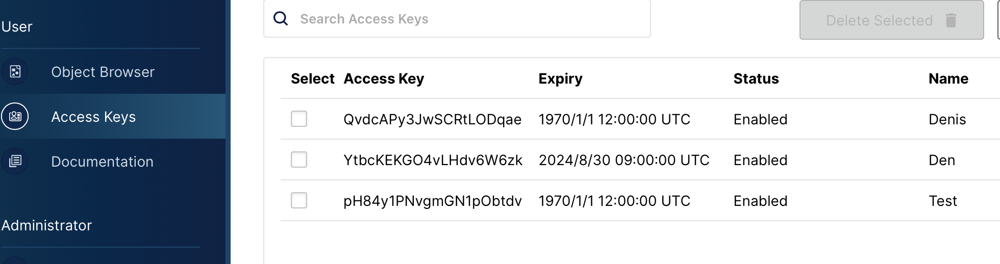

**mem API**

Веб-приложение для взаимодействия с S3-совместимым хранилищем

Используемые технологии:
FastApi
Minio

Функциональность:

●  GET /memes: Получить список всех мемов (с пагинацией).

●  GET /memes/{id}: Получить конкретный мем по его ID.

●  POST /memes: Добавить новый мем (с картинкой и текстом).

●  PUT /memes/{id}: Обновить существующий мем.                                        

●  DELETE /memes/{id}: Удалить мем. 

Установка и запуск:

У вас должны быть установлены зависимости [requirements.txt](https://github.com/SpaceSail/MadSoft/blob/4cdcacd33097e05edc6d5f557fbba0e38a7e5a45/requirements.txt)

1. Копирование репозитория:
git clone https://github.com/SpaceSail/MadSoft.git
2. Установка docker-compose up

Креды для доступа к хранилищу:
[docker-compose.yaml](Docker-compose.yaml)

Модели и валидация данных: [schemas.py](schemas.py)

Логика работы с хранилищем: [storage.py](storage.py)

Логика работы с базой данных: [models.py](models.py)

Роуты: [router.py](router.py)

**Настройка хранилиища**

По умолчанию, веб-интерфейс доступен на localhost:9000
Для рабоиы с файлами необходимо передать access_key и secret_key в экземпляр 
класса storage. Ключи генерируются в веб-интерфейсе храниилища:

